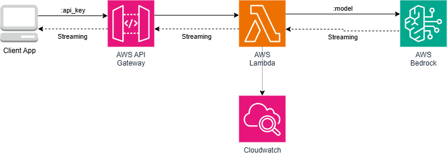

# Bedrock Streaming POC

Real-time token streaming from **Amazon Bedrock** through **API Gateway** to the browser, using AWS Lambda response streaming (available since November 2025).




## Prerequisites

| Tool | Notes |
|------|-------|
| AWS CLI v2 | Configured with valid credentials |
| Terraform ≥ 1.5 | |
| Docker 20+ | Builds the Lambda ZIP in a Linux container |
| Node.js 18+ | Required for the Angular frontend |

Enable Bedrock model access in your AWS account for the model you intend to use (default: **Amazon Nova Lite**).

## Deploy

### 1. Create the Terraform state bucket

```bash
aws s3api create-bucket \
  --bucket bedrock-stream-poc-<YOUR_UNIQUE_ID>-tfstate \
  --region eu-central-1 \
  --create-bucket-configuration LocationConstraint=eu-central-1

aws s3api put-bucket-versioning \
  --bucket bedrock-stream-poc-<YOUR_UNIQUE_ID>-tfstate \
  --versioning-configuration Status=Enabled
```

### 2. Build the Lambda ZIP

```bash
cd lambda
docker build --target export --output type=local,dest=.. .
cd ..
```

### 3. Apply Terraform

```bash
terraform init
terraform plan -out=tfplan
terraform apply tfplan
```

### 4. Get outputs

```bash
terraform output -raw api_key_value
terraform output -raw api_gateway_stream_url
```

### 5. Run the frontend

```bash
cd frontend
npm install
ng serve
```

Open **Settings**, paste the API key and endpoint URL, then go to **Chat**.

## Teardown

To destroy all AWS resources and avoid ongoing costs:

```bash
# Destroy all infrastructure
terraform destroy

# Empty the terraform state S3 bucket (REMOVE IT ONLY AFTER DESTROY IS COMPLETED SUCCESSFULLY)
aws s3 rm s3://$(terraform output -raw TERRAFORM_STATE_BUCKET_NAME) --recursive
```

Once everything is destroyed, you can also remove the Terraform state bucket:

```bash
# Empty the state bucket
aws s3 rm s3://bedrock-stream-poc-<YOUR_UNIQUE_ID>-tfstate --recursive

# Delete the state bucket
aws s3api delete-bucket \
  --bucket bedrock-stream-poc-<YOUR_UNIQUE_ID>-tfstate \
  --region eu-central-1
```

## API

**Request**
```json
POST /stream
x-api-key: <key>

{ "prompt": "Hello", "system": "You are helpful", "maxTokens": 1024 }
```

**Response** (Server-Sent Events)
```
data: {"text": "Hello"}
data: {"text": " world"}
data: {"done": true, "stopReason": "end_turn"}
```

## Configuration

| Variable | Default | Description |
|----------|---------|-------------|
| `aws_region` | `eu-central-1` | Deployment region |
| `bedrock_model_id` | `us.amazon.nova-lite-v1:0` | Foundation model |
| `allowed_cors_origin` | `*` | CORS origin for Lambda Function URL |
| `frontend_bucket_name` | `example-streaming-app-poc` | S3 bucket for the frontend |

## Limitations

This is a proof of concept. Before using in production, consider adding: chat history persistence, a system prompt, rate limiting, a WAF, and a RAG pipeline.